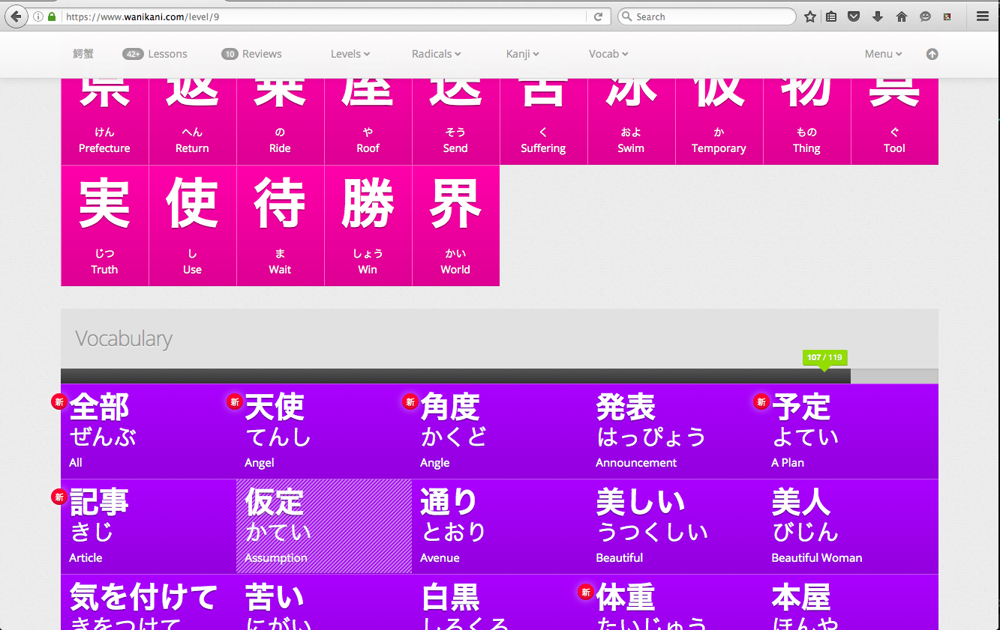

# WaniKani Level Vocabulary Grid

Rearranges the Vocabulary section of the WaniKani Level pages into a grid.

## Installation

Install with Stylish from <https://userstyles.org/styles/130500/wanikani-level-vocabulary-grid>.

## Building

1. Install Node.js and `npm`
2. `sudo npm install -g brunch` to install [Brunch](http://brunch.io/)
3. `npm install` to install Brunch plugins
4. `brunch build`

## Screenshot

## Changelog

- v0.1.0 First Draft
- v0.2.0 Refactor with Stylus and incorporate feedback from @rfindley
