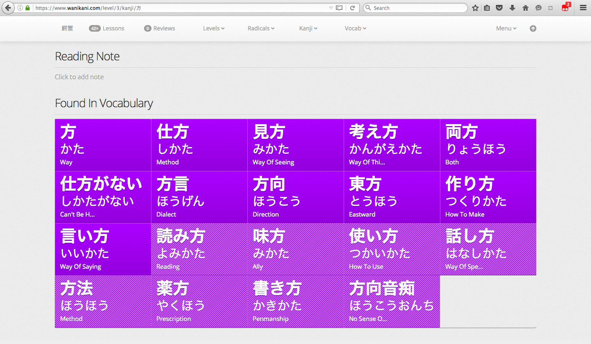

# WaniKani Level Vocabulary Grid

Rearranges WaniKani Level Vocabulary into a grid.

## Installation

Install it with Stylish from <https://userstyles.org/styles/130500/wanikani-level-vocabulary-grid>.

Alternatively install it with Tampermonkey or Greasemonkey from <https://greasyfork.org/en/scripts/21628-wanikani-level-vocabulary-grid>

## Building

1. Install Node.js and `npm`
2. `sudo npm install -g brunch` to install [Brunch](http://brunch.io/)
3. `npm install` to install Brunch plugins
4. `npm run-script build`

## Screenshots

## Changelog

- v0.1.0 First Draft
- v0.2.0 Refactor with Stylus and incorporate feedback from @rfindley
- v0.2.1 Also apply styles to the full Vocabulary list
- v0.3.1 UserScript for people who don't like Stylish, apply styles to kanji pages, more specific CSS for flexbox container
- v0.3.2 Add vertical grid lines

